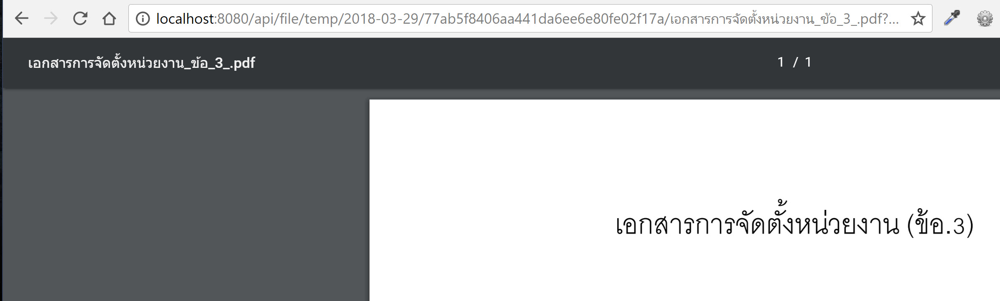

# filestore-example
ตัวอย่างการใช้ library filestore https://github.com/pamarin-tech/filestore

### Upload File

Http `POST`
> /{API_PREFIX}/upload

### Get File

http `GET`
> /{API_PREFIX}/{createdDate}/{uuid}/{baseName}.{extensionFile}  
> /{API_PREFIX}/{createdDate}/{uuid}/{baseName}.{extensionFile}?preview  

### File exist 

http `GET`
> /{API_PREFIX}/{createdDate}/{uuid}/{baseName}.{extensionFile}/exist 

### Delete File 

http `DELETE`
> /{API_PREFIX}/{createdDate}/{uuid}/{baseName}.{extensionFile}
